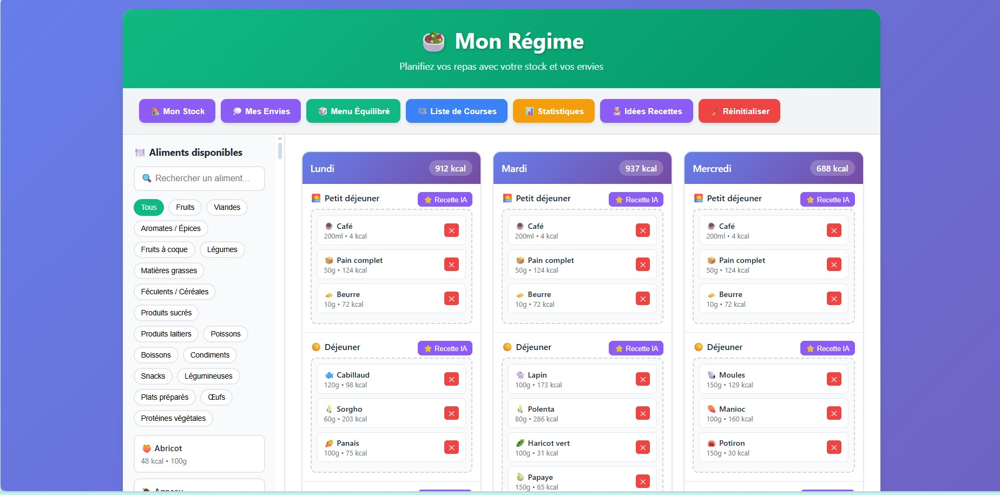

# 🥗 Mon Régime Pack

Un outil simple et pratique pour générer des menus équilibrés sur une semaine, calculer automatiquement les calories et découvrir des idées de recettes.

---

## ✨ Fonctionnalités
- 📅 **Menus hebdomadaires** : planification automatique des repas pour 7 jours.
- 🔢 **Calcul des calories** : suivi de l’apport énergétique pour chaque repas.
- 🍲 **Suggestions de recettes** : pour varier les plaisirs tout en respectant l’équilibre alimentaire.
- ⚙️ **Scripts pratiques** :
  - `lancer_mon_regime.bat` : démarre rapidement l’application.
  - `reparer_mon_regime.bat` : corrige ou réinstalle en cas de problème.

---

## 🚀 Installation
1. **Cloner le dépôt** :
   ```bash
   git clone https://github.com/thierryproust2/mon_regime_pack.git


npm install


node server.js

### 🖼️ Aperçu de l’interface

Voici un exemple de l’interface de Mon Régime Pack :




